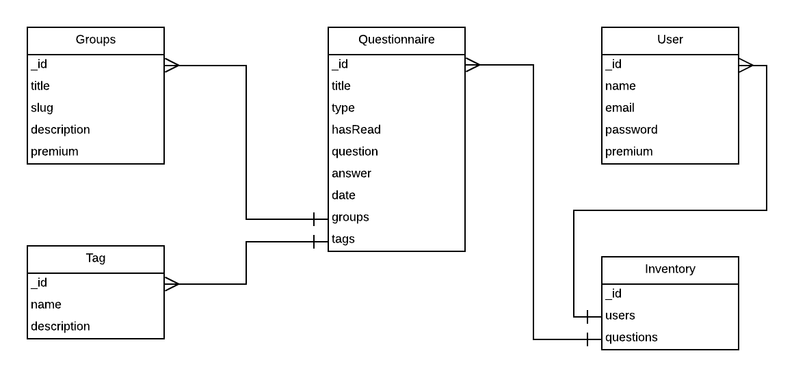

# Quest App

# Database Migration Configuration

The following will be the new URL, due to migration of mlab databases to Mongo Atlas 

```javascript
/* DB Connection
* OLD URL =====
mongodb://admin:<password>@ds347707.mlab.com:47707/quest-app-db
* NEW URL ======
mongodb+srv://admin:<password>@quest-app-db.1v7fx.mongodb.net/quest-app-db?retryWrites=true&w=majority
*/
```


## Objective

_Transfer the data from firebase hosting to Heroku hosting, with scalable architecture and a better Markdown editor (similar to Marxico) built into the app. Also provide OAuth 2.0 authentication so that users will be able to login and add questions._

## Data Modelling



# Useful Links

- [Dropdown button - PURE CSS](https://codepen.io/anon/pen/EqxxBQ#anon-login)
